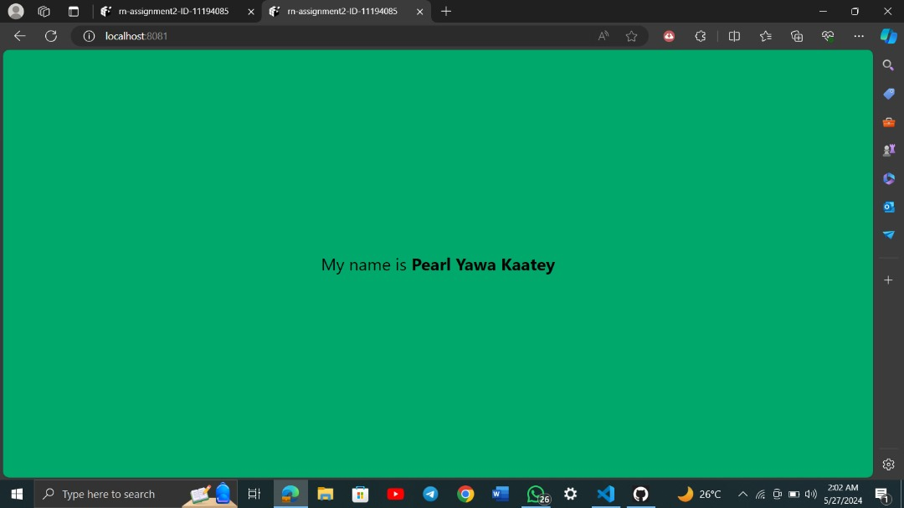

# rn-assignment2-ID

   For this assignment, I was tasked with creating a new React Native blank template project using the Expo CLI. Within the App.js file of the project, I needed to make several changes. First, I changed the background color of the main View component. Next, I edited the Text component to display the text "My name is Pearl Yawa Kaatey". I then increased the font size of the text to 24 and made my name bold, so that it would appear as "My name is “Pearl Yawa Kaatey".

## Screenshot

## Description

1. Created a new React Native blank template project using Expo CLI.
2. In the App.js file:
   - Changed the background color of the View component.
   - Edited the Text component to display "My name is Pearl Yawa Kaatey".
   - Increased the font size of the text to 24.
   - Made the name "Pearl Yawa Kaatey" bold.
3. Committed the changes frequently to a new repository named rn-assignment2-ID-11194085.

## Student ID

11194085